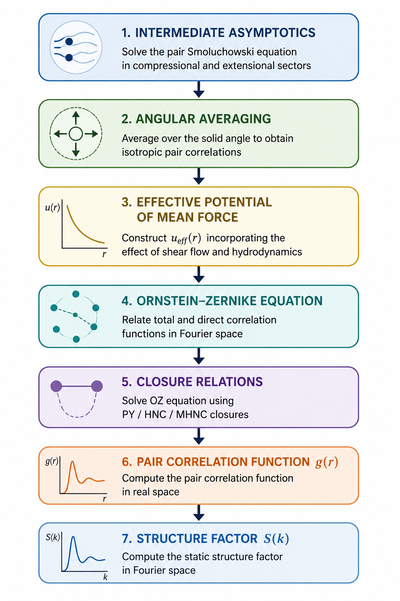
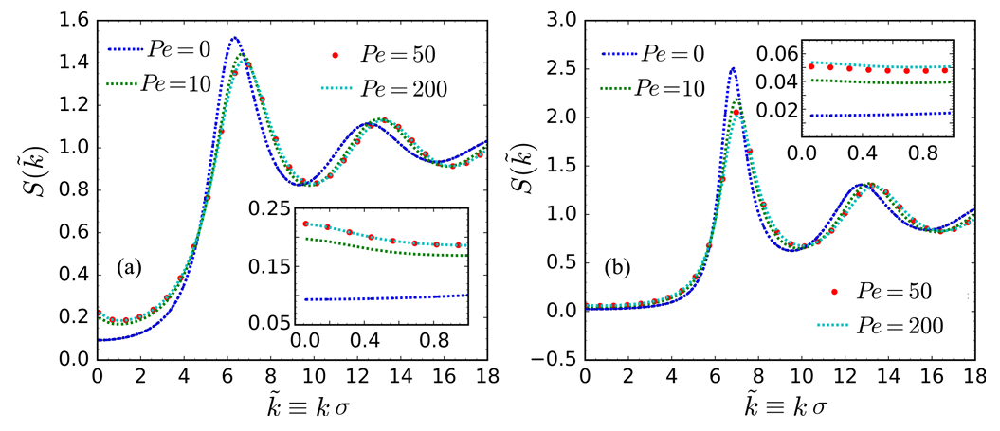

# High-Density Colloids under Shear: Integral-Equation Theory

Python, Jupyter and Mathematica implementation accompanying

L. Banetta, F. Leone, C. Anzivino, M. S. Murillo and A. Zaccone

[*Microscopic theory for the pair correlation function of liquidlike colloidal suspensions under shear flow*](https://doi.org/10.1103/PhysRevE.106.044610)

*Physical Review E* **106**, 044610 (2022)

A preprint of the article is available in the [`papers/`](papers/) directory of this repository.

---

## Overview

This repository contains the notebooks and input data used to extend the intermediate-asymptotics theory of sheared colloidal suspensions to finite particle concentrations using liquid-state integral equation theory.

The workflow combines:

- analytical intermediate-asymptotics solutions of the pair Smoluchowski equation with shear flow,
- construction of an effective potential of mean force,
- Ornstein–Zernike integral equation,
- Percus–Yevick (PY),
- Hypernetted Chain (HNC),
- Modified Hypernetted Chain (MHNC)

to compute

- pair correlation functions \(g(r)\),
- static structure factors \(S(k)\)

of colloidal suspensions under shear flow.

---

## Computational workflow



---

## Representative result

Structure factor of sheared hard-sphere colloidal suspensions predicted by the integral-equation theory. Increasing Péclet number enhances long-wavelength density fluctuations and modifies the main structural peak.



---

## Repository structure

```
notebooks/
```

Jupyter and Mathematica notebooks implementing the theoretical workflow.

```
data/
```

Input data generated from the intermediate-asymptotics calculations.

```
papers/
```

Associated publication.

---

## Getting Started

Clone the repository:

```bash
git clone https://github.com/ZacconeAlessio/Colloidal-Microstructure-under-Shear-High-Densities.git
```

Install the required Python packages:

```bash
pip install -r requirements.txt
```

The notebooks are intended to be explored in the following order:

1. `Average_Compressional_Extensional.ipynb`
2. `IAgrid_to_HNCgrid.ipynb`
3. `Percus-Yevick_effective_HSunit.ipynb`
4. `HNC.ipynb`
5. `MHNC.ipynb`

The Mathematica notebooks in `notebooks/analytic_solutions/` provide the analytical derivations underlying the integral-equation calculations.

---

## Requirements

The Python notebooks were developed using standard scientific Python packages.

Install the required packages with

```bash
pip install -r requirements.txt
```

Mathematica notebooks require **Wolfram Mathematica** (version 12 or later recommended).

---

## Companion repository

The dilute-regime intermediate-asymptotics MATLAB implementation is available in the companion repository:

**https://github.com/ZacconeAlessio/Colloidal-Microstructure-under-Shear**

The present repository extends that framework to finite particle concentrations using liquid-state integral-equation theory (PY, HNC and MHNC closures).

---

## Note

Some notebooks are archival research notebooks and may reference intermediate files not included in the current repository; see `notebooks/README.md` for details.

---

## Reproducibility

This repository contains the notebooks, analytical derivations, and representative input datasets used in the calculations reported in

> Banetta, Leone, Anzivino, Murillo & Zaccone,
> *Microscopic theory for the pair correlation function of liquidlike colloidal suspensions under shear flow*,
> **Physical Review E** 106, 044610 (2022).

The repository contains the notebooks, analytical derivations and input data required to reproduce the computational workflow presented in the accompanying publication.

The notebooks are intended to be executed in the order described in the main README.

---

# Citation

**If you use this code in academic work, please cite**

L. Banetta, F. Leone, C. Anzivino, M. S. Murillo and A. Zaccone

[*Microscopic theory for the pair correlation function of liquidlike colloidal suspensions under shear flow*](https://doi.org/10.1103/PhysRevE.106.044610)

*Physical Review E* **106**, 044610 (2022)

A preprint of the article is available in the [`papers/`](papers/) directory of this repository.
